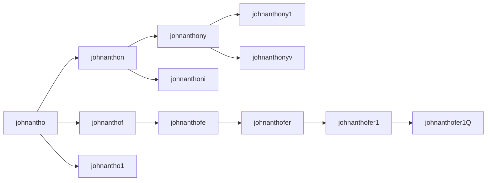

# Guessc
A tool to recover part of the [Pwnd Passwords list](https://haveibeenpwned.com/Passwords) without using dicionaries or brute force.
## What is Guessc?
Guessc is a tool to recover part of the [Pwnd Passwords list](https://haveibeenpwned.com/Passwords) without using dictionaries or brute force and taking advantage of something I've called **information overflow vulnerability**.
## So, how many passwords are we talking about?
In numbers, the last execution revealed 154 millions of passwords from a list of 936 millions of hashes. It lasted an hour and a half using an Intel core i3 with 16G of memory.
## What is an "Information overflow" vulnerability?
**Information overflow** is a vulnerabilty that appears when a hidden repository contains some characteristic that can reveal part or all of its content.
## What is the "Pwned Passwords list" (PPL)?
As [haveibeenpwned](https://haveibeenpwned.com/Passwords) explains,

>"Pwned Passwords" are hundreds of millions of real world passwords previously exposed in data breaches.

This list doesn't come with the passwords in clear text, it comes as a list of [SHA1](https://en.wikipedia.org/wiki/SHA-1) or [MD5](https://en.wikipedia.org/wiki/MD5) hashes as a precaution that no one can discover others passwords.

_Sample of head **00000** (the last number shows the number of users sharing the same password)_:
```
0005AD76BD555C1D6D771DE417A4B87E4B4:10
000A8DAE4228F821FB418F59826079BF368:4
000DD7F2A1C68A35673713783CA390C9E93:876
001E225B908BAC31C56DB04D892E47536E0:6
006BAB7FC3113AA73DE3589630FC08218E7:3
008C4037D3E893F8E1FA7BAD32B9F60948C:3
008CD1806EB7B9B46A8F87690B2AC16F617:6
00A0E3B9F25FF41DE4B5AC238C2D545C7A8:20
00A1D4B746FAA3FD526FF6D5BC8052FDB38:21
00CAEF405439D57847A8657218C618160B2:21
```
## Why is the PPL vulnerable?
The **massive amount of data** and the **intrinsic nature of the passwords** have created a sequencial relationship between them. The password choosen by one user is, sometimes, shared and expanded by other users with one more symbol in a global password tree:


It's also possible that someone decided to hash, not only the passwords, but also their smaller parts. Some recovered passwords show a complexity that is difficult to explain due to the reuse of root passwords between users:


| Password | SHA1 Tail | Count |
| --- | --- | --- |
|  c0411ee06389423b814a209fab2 | 36F42DE7A3A4825700E21AB12995B1894E3 | 8 |
|  dc0fa7df3d07904a09288bd2d2bb5f | A9F421BB7B59B2E2E09C79D3D009D164BBA | 29 |
|  coolguy119d199198012313Q | D07AE2D0EC82AD75498F862CEFA1D8A674E | 1 |

Whatever it is, at the end, we get a tree relationship between a lot of passwords that **can be traversed with a simple search algorithm adding one symbol at a time**.

## Let's start recovering passwords
Download the PPL hashes (command explained [here](https://github.com/HaveIBeenPwned/PwnedPasswordsDownloader/issues/79))
```
mkdir -p $HOME/src/pwnedpasswords
cd $HOME/src/pwnedpasswords
curl -s --retry 10 --retry-all-errors --remote-name-all --parallel --parallel-max 150 "https://api.pwnedpasswords.com/range/{0,1,2,3,4,5,6,7,8,9,A,B,C,D,E,F}{0,1,2,3,4,5,6,7,8,9,A,B,C,D,E,F}{0,1,2,3,4,5,6,7,8,9,A,B,C,D,E,F}{0,1,2,3,4,5,6,7,8,9,A,B,C,D,E,F}{0,1,2,3,4,5,6,7,8,9,A,B,C,D,E,F}"
```
Be patient, it will take some time to download all the hashes (30G aprox.)

Clone the git repository:
```
cd $HOME/src
git clone https://github.com/redsnk/guessc
cd guessc
```
Compile:
```
make
```
Execute with the parameters you need.

Guessc needs **8G** of free memory to load all the hashes, if you have it, execute:
```
./guessc ""
```
Be patient, it will take some time to load all the hashes into the memory.

Passwords discovered will be saved on **guessc.txt** file.

If you have less memory, you can pass the amount, per example 4G, **but the speed will drop dramatically due to disk access**:
```
./guessc -c4 ""
```
If you want **test de tool** only without caching any hash, you can execute it with **-c0** and the parameter **-n** to print the passwords:
```
./guessc -c0 -n ""
```
if you want to see all the options, execute **guessc** without any argument, you can increase the number of threads with the parameter **-t** per example.
```
./guessc -t8 ""
```

## What is checkpwd.sh?
**checkpwd.sh** is a script to check if one password exists inside the [PPL](https://haveibeenpwned.com/Passwords):
```
./checkpwd.sh qwertyuiop
```
```
output:
D2029F64D445BD131FFAA399A42D2F8E7DC:2119106
```

## Where I can find the last list of passwords discovered?
You can find the list at the [Releases](https://github.com/redsnk/guessc/releases) section.

**Enjoy!**
